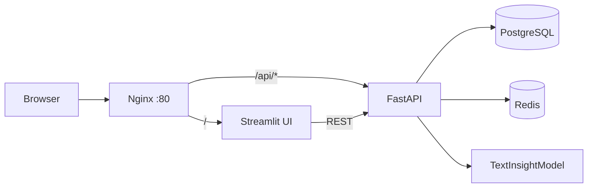

# AI Web Text Service

Веб-сервис для анализа текста: API принимает текст, лёгкая ML-модель оценивает тональность, читабельность и ключевые характеристики, сохраняет результат в БД и отдаёт историю запросов в интерфейс.

## Архитектура

Пользователь открывает `http://localhost`. Nginx принимает весь трафик, ограничивает частоту запросов и маршрутизирует:

- `/api/*` -> FastAPI backend
- `/` -> Streamlit frontend

Backend общается с PostgreSQL через SQLAlchemy ORM, проверяет Redis в health check и хранит состояние в БД. UI общается только с REST API и не имеет доступа к БД или Redis.



## Запуск

1. Скопируйте пример окружения:

```bash
cp .env.example .env
```

2. Запустите проект одной командой:

```bash
docker compose up --build -d
```

3. Откройте интерфейс:

```text
http://localhost
```

## API примеры

Health check:

```bash
curl http://localhost/api/health
```

Анализ текста:

```bash
curl -X POST http://localhost/api/analyze \
  -H "Content-Type: application/json" \
  -d "{\"text\":\"FastAPI делает сервис понятным и быстрым.\",\"creativity\":0.3,\"max_tokens\":120}"
```

История:

```bash
curl http://localhost/api/analyses?limit=5
```

Очистка истории:

```bash
curl -X DELETE http://localhost/api/analyses
```

Swagger доступен по адресу:

```text
http://localhost/api/docs
```

## Критерии из ТЗ

- `# Управление жизненным циклом контекстных переменных`: FastAPI lifespan инициализирует модель, Redis и проверяет подключение к БД.
- `# Валидация данных`: строгие Pydantic request/response схемы с ограничениями.
- `# Обработка ошибок`: кастомные обработчики возвращают понятный JSON и корректные HTTP статусы.
- `# Изоляция ML-логики`: модель вынесена в отдельный класс `TextInsightModel`.
- `# Управление ресурсами`: ограничены длина входного текста и максимальная длина результата.
- `# Логирование`: логируются этапы запуска и инференса.
- `# UX асинхронности`: UI показывает прогресс и обрабатывает ожидание.
- `# Reverse Proxy`: Nginx является единой точкой входа и маршрутизирует `/api/*`.
- `# ORM`: SQLAlchemy используется без прямых SQL запросов в бизнес-логике.
- `# Версионирование данных`: Alembic миграция создаёт таблицу анализов.
- `# Docker Compose`: настроены сети, volumes, depends_on и healthcheck.
- `# Stateless архитектура`: состояние хранится в PostgreSQL, не в памяти API.
- `# Graceful Shutdown`: FastAPI закрывает Redis/DB подключения в lifespan shutdown.
- `# Health Checks`: API проверяет БД, Redis и готовность ML-модели.
