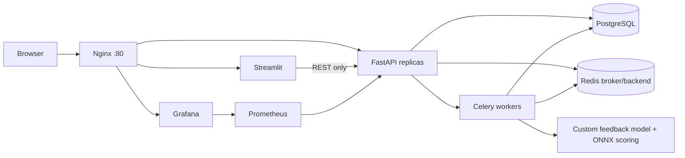

# Customer Feedback Desk

Customer Feedback Desk - веб-сервис для малого бизнеса и службы поддержки. Он принимает клиентские обращения, определяет тональность, категорию проблемы, срочность, формирует краткое резюме и черновик ответа менеджеру. Когда обращений становится много, менеджер легко пропускает срочный негатив: задержку доставки, спор по оплате, жалобу на качество или плохой опыт поддержки. Сервис закрывает простую потребность: быстро разобрать входящий поток сообщений, выделить приоритетные обращения и подготовить первый ответ клиенту.

## Архитектура

Пользователь открывает `http://localhost`. Nginx является единой точкой входа, ограничивает частоту API-запросов и маршрутизирует:

- `/` -> Streamlit UI
- `/api/*` -> FastAPI API
- `/grafana/*` -> Grafana



## Запуск

```bash
cp .env.example .env
docker compose up --build -d
```

Открыть интерфейс:

```text
http://localhost
```

Демо-вход:

- `manager@example.com` / `manager123`
- `admin@example.com` / `admin123`

В интерфейсе также есть регистрация нового пользователя. Аккаунты сохраняются в PostgreSQL, пароли хешируются bcrypt, а запросы к личному кабинету выполняются с JWT-токеном.

Swagger:

```text
http://localhost/api/docs
```

Метрики:

```text
http://localhost/api/metrics
```

Grafana:

```text
http://localhost/grafana/
```

Логин/пароль по умолчанию: `admin` / `admin`.
Prometheus datasource и dashboard `Customer Feedback Desk API` создаются автоматически через Grafana provisioning.

## API примеры

Health check:

```bash
curl http://localhost/api/health
```

Асинхронная постановка обращения в очередь:

```bash
curl -X POST http://localhost/api/tickets \
  -H "Authorization: Bearer <token>" \
  -H "Content-Type: application/json" \
  -d "{\"customer_name\":\"Анна\",\"channel\":\"chat\",\"text\":\"Курьер опоздал на два дня, поддержка не отвечает. Срочно верните деньги.\",\"creativity\":0.35,\"max_tokens\":160}"
```

Polling статуса:

```bash
curl http://localhost/api/tasks/<task_id>
```

Синхронный анализ для отладки:

```bash
curl -X POST http://localhost/api/tickets/sync \
  -H "Content-Type: application/json" \
  -d "{\"customer_name\":\"Анна\",\"channel\":\"chat\",\"text\":\"Спасибо, менеджер быстро помог решить вопрос.\",\"creativity\":0.2,\"max_tokens\":120}"
```

История обращений:

```bash
curl -H "Authorization: Bearer <token>" http://localhost/api/tickets?limit=10
```

Регистрация:

```bash
curl -X POST http://localhost/api/auth/register \
  -H "Content-Type: application/json" \
  -d "{\"email\":\"new@example.com\",\"password\":\"secret123\",\"name\":\"Ирина\",\"company\":\"Моя компания\"}"
```

Вход:

```bash
curl -X POST http://localhost/api/auth/login \
  -H "Content-Type: application/json" \
  -d "{\"email\":\"manager@example.com\",\"password\":\"manager123\"}"
```

## Собственная модель

`# Своя модель`

Модель находится в `backend/app/ml`. Для проекта создан локальный учебный набор `training_data.json` с типовыми обращениями поддержки: доставка, оплата, качество, сервис, нейтральные и негативные сообщения. Скрипт `train_model.py` строит артефакты модели в `model_cache`:

- `model_card.json` - описание признаков, классов и процесса обучения;
- `customer_feedback_model.onnx` - компактный ONNX-граф для scoring признаков категории.

Процесс обучения:

1. Собран небольшой доменный датасет типовых обращений.
2. Выделены признаки по словам-маркерам: доставка, оплата, качество, сервис, негатив и срочность.
3. Для быстрого инференса сформирован ONNX-граф линейного scoring.
4. Runtime использует ONNX Runtime, а при недоступности артефакта переходит на безопасный rule-based fallback.
5. Модель возвращает `confidence` и `explanations`: слова и фразы, из-за которых обращение было отнесено к негативу, категории или высокой срочности.

`# Оптимизация инференса`

ONNX Runtime подключён в `TextInsightModel.load()`, а Dockerfile генерирует ONNX-артефакт на этапе сборки.

## Тесты

```bash
cd backend
pytest
```

Тесты проверяют модель, OpenAPI-контракт и Pydantic-схемы.

- `# Метрики`: Prometheus собирает `/api/metrics`, Grafana подключена в compose.
- `# Тесты`: pytest-проверки модели, схем и API-контракта.
